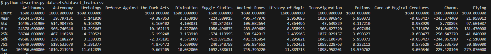

# Datascience X Logistic Regression: Harry Potter and the Data Scientist

## Summary
This project is a part of the DataScience X Logistic Regression series, where we embark on a magical journey to save Hogwarts by employing data science techniques and logistic regression. The task is to build a classifier to recreate the Sorting Hat's magic, assigning students to their respective houses based on given data.

## Table of Contents
- [Introduction](#introduction)
- [Objectives](#objectives)
- [Instructions](#instructions)
- [Principal Part](#mandatory-part)
   - [Data Analysis](#data-analysis)
   - [Data Visualization](#data-visualization)
   - [Logistic Regression](#logistic-regression)
- [Annexes](#annexes)

## Introduction
The Sorting Hat at Hogwarts has been enchanted, leaving the school in chaos as it can no longer assign students to their houses. As a muggle data scientist, you're tasked with recreating the Sorting Hat's magic using your knowledge of data science and logistic regression.

## Objectives
The primary goal of this project is to implement logistic regression as a classification model to predict the houses of Hogwarts students. Participants will explore data analysis techniques, data visualization, and logistic regression to achieve this objective.

## Instructions
Participants are encouraged to follow the instructions provided in this readme and leverage their skills to complete the project. While any programming language can be used, libraries facilitating plotting and statistical calculations are recommended.

## Principal Part
### Data Analysis
Participants are required to create a program to analyze numerical features of the dataset without using predefined functions.

### Data Visualization
Scripts for various visualization methods such as histograms, scatter plots, and pair plots must be implemented to gain insights into the data.

Histogram:

Scatter Plot:

Pair Plot:

### Logistic Regression
Implement logistic regression for multi-class classification using gradient descent to train the model.

I made an interface to train each house individually and to see the evolution of the loss.

## Annexes
Mathematical formulations for logistic regression and examples of data visualization techniques are included for reference.

---
